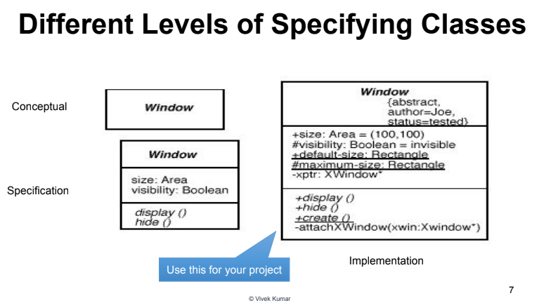

# JUnit Notes (shitty ahh)

## Contents
- [Boilerplate code for JUnit runner Class](#boilerplate-code-for-junit-runner-class)
- [A few JUnit Assertion Methods](#a-few-junit-assertion-methods)
- [Test with a timeout](#test-with-a-timeout)
- [Test for exceptions](#test-for-exceptions)
- [Setup and Teardown](#setup-and-teardown)
- [UML Class Notations](#uml-class-notations)
- [Drawings required](#drawings-required)
- [Multiplicities](#multiplicities)


## Boilerplate code for JUnit runner Class

```
Result result = JUnitCore.runClasses(whatever_your_class_name.class);
for(Failure failure : result.getFailures()){
    System.out.println(failure.toString());
}
System.out.println(result.wasSuccessful());
```

## A few JUnit Assertion Methods:
> assertTrue(Test)
>
> assertFalse(Test)
>
> asssertEquals(expected, actual)
>
> assertSame(expected, actual)
>
> assertNotSame(expected, actual)
>
> assertNull(value)
>
> assertNotNull(value)
>
> fail() -> causes the current test to fail immediately

**Fun fact, each method can also display a string to be displayed if it fails**
```
assertEquals("message", expected, actual)
```

## Test with a timeout
```
@Test (tiemout = 5000)
public void name() {...}
```
The above method will be considered a failure if it doesn't finish running within 5000 ms

## Test for exceptions
```
@Test (expected = ExceptionType.class)
public void name() {...}
```

For Example
```
@Test (expected = ArrayIndexOutOfBoundsException.class)
public void testBadIndex(){
    ArrayIntList list = new ArrayIntList();
    list.get(4)     // should fail
}
```

## Setup and Teardown
Basically, piece of code which needs to run before every test, or at the begining of the class code.

It can be used to initialise variables, blah blah blah.
- Code to be runned before every test
```
@Before
public void name() {...}
@After
public void name() {...}
```

- Code to be runned before the entire test class runs
```
@BeforeClass
public void name() {...}
@AfterClass
public void name() {...}
```

------------------------
# UML Class Notations

- A class is a rectangle divided into three parts
1. Class **Name**
2. Class **attributes**
3. Class **operations**
- Modifiers
1. Private : **-**
2. Public : **+**
3. Protected : **#**
4. Static : ***Underlined***
- Abstract class/methods
- - Name in ***italics***



## Drawings required

-----

- Solid arrow with diamond head : **Composition**
```
a ---* b
```
Here, A is composed of B

-----
- Solid Arrow with spear head : **Association**
```
a ---> b
```
here, A holds a reference to B

-----

- Simple solid line : **Binary Association** -> Both Entities know about each other
```
a --- b 
```

-----
- Dotted Arrow : **Dependency**
```
a ...> b
```
Here, A is dependent on B. A is requesting service from B

-----

- One rectangle above the other rectangle, and a arrow going upwards : **Inheritance**
```
    Mammal
      ^
      |
      |
     Dog
   ^     ^
   |     |
   |     |
Poodle Labrador
```

-----

## Multiplicities

>0..1 : 0 to 1 instance
>
>0..* : no limit
>
>1    : 1 instance
>
>1..* : atleast 1 instance

Example 
```
           1..2         1..5
Customer <------------------  BankAccount
```
This means one bank account can have 1 to 2 owners (joint account) and one customer can have 1 to 5 accounts

- UML Exceptions
```
                java.lang.Exception
                        ^
                        |
        <<throw>>       |
MyClass ---------> MyException
```


